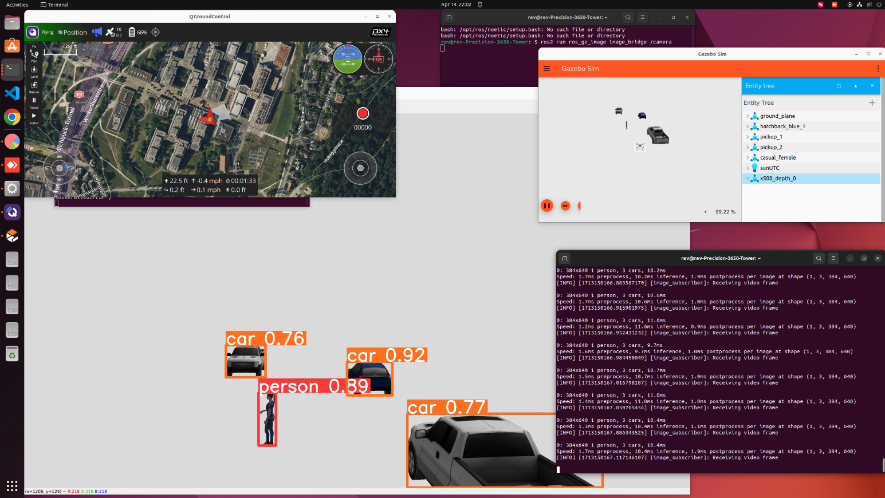

# PX4-ROS2-Gazebo-YOLOv9
Aerial Object Detection using a Drone with PX4 Autopilot and ROS 2. PX4 SITL and Gazebo Garden used for Simulation. YOLOv9 used for Object Detection.
<p align="center">
  
</p>

## Installation
### Create a virtual environment
```commandline
# create
python -m venv ~/px4-venv

# activate
source ~/px4-venv/bin/activate
```

### Install PX4
```commandline
cd ~
git clone https://github.com/PX4/PX4-Autopilot.git --recursive
bash ./PX4-Autopilot/Tools/setup/ubuntu.sh
cd PX4-Autopilot/
make px4_sitl
```
### Install ROS 2
```commandline
cd ~
sudo apt update && sudo apt install locales
sudo locale-gen en_US en_US.UTF-8
sudo update-locale LC_ALL=en_US.UTF-8 LANG=en_US.UTF-8
export LANG=en_US.UTF-8
sudo apt install software-properties-common
sudo add-apt-repository universe
sudo apt update && sudo apt install curl -y
sudo curl -sSL https://raw.githubusercontent.com/ros/rosdistro/master/ros.key -o /usr/share/keyrings/ros-archive-keyring.gpg
echo "deb [arch=$(dpkg --print-architecture) signed-by=/usr/share/keyrings/ros-archive-keyring.gpg] http://packages.ros.org/ros2/ubuntu $(. /etc/os-release && echo $UBUNTU_CODENAME) main" | sudo tee /etc/apt/sources.list.d/ros2.list > /dev/null
sudo apt update && sudo apt upgrade -y
sudo apt install ros-humble-desktop
sudo apt install ros-dev-tools
source /opt/ros/humble/setup.bash && echo "source /opt/ros/humble/setup.bash" >> .bashrc
pip install --user -U empy pyros-genmsg setuptools
```
### Install the binary Gazebo Garden/ROS 2 Humble packages
Folow these [instruction](https://gazebosim.org/docs/garden/install_ubuntu#binary-installation-on-ubuntu) to install gz-garden from [packages.osrfoundation.org](https://packages.osrfoundation.org/gazebo/ubuntu/) repository.
Install ros_gz from the non official binary packages from apt:
```sh
apt-get install ros-humble-ros-gzgarden
```
### Setup Micro XRCE-DDS Agent & Client
```commandline
cd ~
git clone https://github.com/eProsima/Micro-XRCE-DDS-Agent.git
cd Micro-XRCE-DDS-Agent
mkdir build
cd build
cmake ..
make
sudo make install
sudo ldconfig /usr/local/lib/
```
### Build ROS 2 Workspace
```commandline
mkdir -p ~/autodrone_ws/src/
cd ~/autodrone_ws/src/
git clone https://github.com/PX4/px4_msgs.git
git clone https://github.com/PX4/px4_ros_com.git
cd ..
source /opt/ros/humble/setup.bash
colcon build
```
### Install MAVSDK
```commandline
pip install mavsdk
pip install aioconsole
pip install pygame
sudo apt install ros-humble-ros-gzgarden
pip install numpy
pip install opencv-python
```
### Install QGroundControl:
https://docs.qgroundcontrol.com/master/en/qgc-user-guide/getting_started/download_and_install.html
```sh
sudo usermod -a -G dialout $USER
sudo apt-get remove modemmanager -y
sudo apt install gstreamer1.0-plugins-bad gstreamer1.0-libav gstreamer1.0-gl -y
```
- Download: [QGroundControl.AppImage](https://d176tv9ibo4jno.cloudfront.net/latest/QGroundControl.AppImage)
```sh
cd ~/Downloads/
chmod +x ./QGroundControl.AppImage
   ```
- Start QGroundControl
`./QGroundControl.AppImage  (or double click app icon)`
- Go to Application Settings (Press the Q in the upper left corner then "Application Settings"), and tick the "Virtual Joystick" box.
### Install YOLO
```commandline
pip install ultralytics
```
### Additional Configs
- Put below lines in your bashrc:
```commandline
source /opt/ros/humble/setup.bash
export GZ_SIM_RESOURCE_PATH=~/.gz/models
```
- Copy the content of models from main repo to ~/.gz/models
- Copy default.sdf from worlds folder in the main repo to ~/PX4-Autopilot/Tools/simulation/gz/worlds/

## Run
### Manual flight (through QGroundControl)
With QGroundControl and the simulation running, perform a takeoff through QGroundControl (click "takeoff" and accept).
Fly drone either with virtual joystick or connected transmitter.
You need several terminals.
  
- Start QGroundControl
`./QGroundControl.AppImage  (or double click app icon)`

```commandline
Terminal #1:
cd ~/Micro-XRCE-DDS-Agent
MicroXRCEAgent udp4 -p 8888

Terminal #2:
cd ~/PX4-Autopilot
PX4_SYS_AUTOSTART=4002 PX4_GZ_MODEL_POSE="268.08,-128.22,3.86,0.00,0,-0.7" PX4_GZ_MODEL=x500_depth ./build/px4_sitl_default/bin/px4

Terminal #3:
ros2 run ros_gz_image image_bridge /camera

Terminal #4:
source ~/px4-venv/bin/activate
cd ~/Gazebo_simulation
python uav_camera_det.py
```
