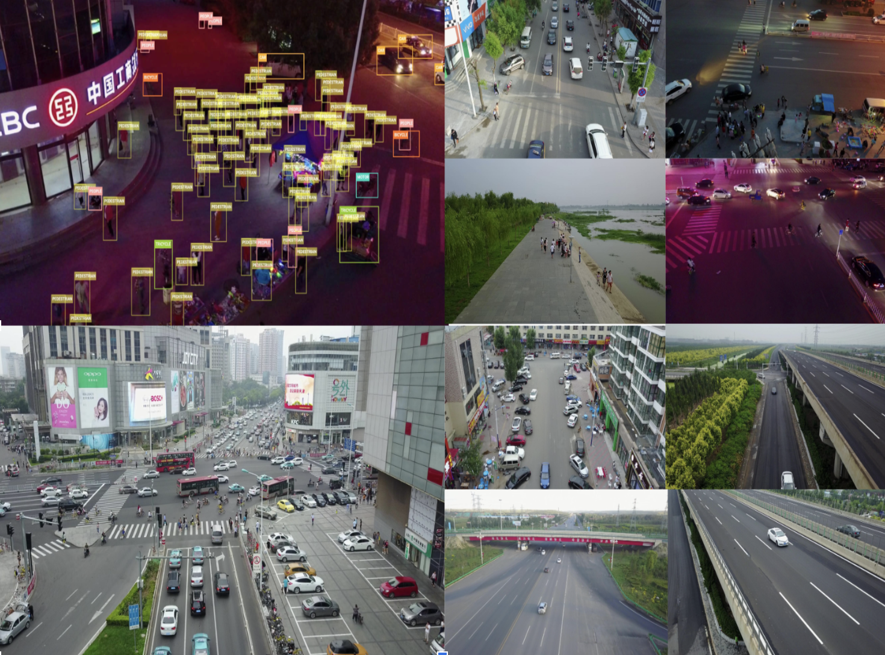

# Object Detection

## 1 Dataset 

The [VisDrone Dataset](https://github.com/VisDrone/VisDrone-Dataset) is a large-scale benchmark created by the AISKYEYE team at the Lab of Machine Learning and Data Mining, Tianjin University, China. It contains carefully annotated ground truth data for various computer vision tasks related to drone-based image and video analysis.

VisDrone is composed of 288 video clips with 261,908 frames and 10,209 static images, captured by various drone-mounted cameras. The dataset covers a wide range of aspects, including location (14 different cities across China), environment (urban and rural), objects (pedestrians, vehicles, bicycles, etc.), and density (sparse and crowded scenes). The dataset was collected using various drone platforms under different scenarios and weather and lighting conditions. These frames are manually annotated with over 2.6 million bounding boxes of targets such as pedestrians, cars, bicycles, and tricycles. Attributes like scene visibility, object class, and occlusion are also provided for better data utilization.



### The VisDrone dataset is organized into five main subsets, each focusing on a specific task:

- **Task 1:** Object detection in images
- **Task 2:** Object detection in videos
- **Task 3:** Single-object tracking
- **Task 4:** Multi-object tracking
- **Task 5:** Crowd counting

### Applications

The VisDrone dataset is widely used for training and evaluating deep learning models in drone-based computer vision tasks such as object detection, object tracking, and crowd counting. The dataset's diverse set of sensor data, object annotations, and attributes make it a valuable resource for researchers and practitioners in the field of drone-based computer vision.
The dataset can be downloaded here.

### Usage
To train a YOLOv8n model on the VisDrone dataset for 100 epochs with an image size of 640, you can use the following code snippets. For a comprehensive list of available arguments, refer to the model [Training page](https://docs.ultralytics.com/modes/train/).

```python
from ultralytics import YOLO

# Load a model
model = YOLO('yolov8n.pt')  # load a pretrained model (recommended for training)

# Train the model
results = model.train(data='VisDrone.yaml', epochs=100, imgsz=640)
```

## 2 Train and Evaluate Algorithms on VisDrone dataset

### YOLOv9

#### Training
Download the VisDrone dataset and put into the yolov9_Visdrone directory.
```shell
conda create -n yolov9
conda activate yolov9
pip install -r requirements.txt
python train_dual.py --batch 16 --epochs 100 --img 640 --device 0 --min-items 0 --close-mosaic 15 --data Visdrone_data/data.yaml --weights ../weights/yolov9-c.pt --cfg models/detect/yolov9-c.yaml --hyp hyp.scratch-high.yaml
```
The training results will be in a './runs/train' directory.

#### Evaluation
```shell
python val_dual.py --data Visdrone_data/data.yaml --img 640 --batch 64 --conf 0.001 --iou 0.7 --device 0 --weights './runs/train/exp19/weights/best.pt' --save-json --name yolov9_c_640_val
```
Replace 'exp19' with your experiment directory name.


## 3 Deploy on NVIDIA Jetson Orin Nano

### What is NVIDIA Jetson?

NVIDIA Jetson is a series of embedded computing boards designed to bring accelerated AI (artificial intelligence) computing to edge devices. These compact and powerful devices are built around NVIDIA's GPU architecture and are capable of running complex AI algorithms and deep learning models directly on the device, without needing to rely on cloud computing resources. Jetson boards are often used in robotics, autonomous vehicles, industrial automation, and other applications where AI inference needs to be performed locally with low latency and high efficiency. Additionally, these boards are based on the ARM64 architecture and runs on lower power compared to traditional GPU computing devices.

### What is NVIDIA JetPack?

NVIDIA JetPack SDK powers the Jetson modules and is the most comprehensive solution for building accelerated AI applications, reducing time to market. JetPack includes Jetson Linux with bootloader, Linux kernel, Ubuntu desktop environment, and a complete set of libraries for acceleration of GPU computing, multimedia, graphics, and computer vision.

### Flash JetPack to NVIDIA Jetson

- For official NVIDIA Development Kits, download an image and prepare an SD card with JetPack from [this link](https://developer.nvidia.com/).
- For Seeed Studio reComputer J4012 device, flash JetPack to the included SSD from [this link](https://developer.nvidia.com/).

**Note:** After flashing, enter `sudo apt update && sudo apt install nvidia-jetpack -y` on the device terminal to install all the remaining JetPack components needed.

### Start with Docker

The fastest way to get started with Ultralytics YOLOv8 on NVIDIA Jetson is to run with pre-built docker image for Jetson.

Execute the below command to pull the Docker containter and run on Jetson. This is based on l4t-pytorch docker image which contains PyTorch and Torchvision in a Python3 environment.

```
t=ultralytics/ultralytics:latest-jetson && sudo docker pull $t && sudo docker run -it --ipc=host --runtime=nvidia $
```
### Start without Docker
#### Install Ultralytics Package
Here we will install ultralyics package on the Jetson with optional dependencies so that we can export the PyTorch models to other different formats. We will mainly focus on NVIDIA TensorRT exports because TensoRT will make sure we can get the maximum performance out of the Jetson devices.

- **1:** Update packages list, install pip and upgrade to latest

```
sudo apt update
sudo apt install python3-pip -y
pip install -U pip
```

- **2:** Install ultralytics pip package with optional dependencies
```
pip install ultralytics[export]
```
- **3:** Reboot the device
```
sudo reboot
```

#### Install PyTorch and Torchvision
The above ultralytics installation will install Torch and Torchvision. However, these 2 packages installed via pip are not compatible to run on Jetson platform which is based on ARM64 architecture. Therefore, we need to manually install pre-built PyTorch pip wheel and compile/ install Torchvision from source.


- **1:** Uninstall currently installed PyTorch and Torchvision
```

pip uninstall torch torchvision

```

- **2:** Install PyTorch 2.2.0 according to JP6.0
```
bashCopy codesudo apt-get install -y libopenblas-base libopenmpi-dev
wget https://developer.download.nvidia.com/compute/redist/jp/v512/pytorch/torch-2.1.0a0+41361538.nv23.06-cp38-cp38-linux_aarch64.whl -O torch-2.1.0a0+41361538.nv23.06-cp38-cp38-linux_aarch64.whl
pip install torch-2.1.0a0+41361538.nv23.06-cp38-cp38-linux_aarch64.whl
```


