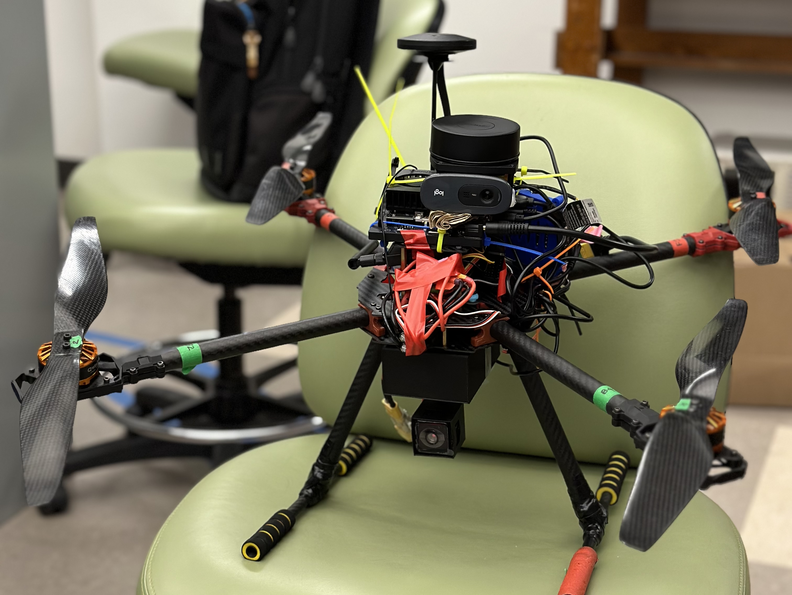

# Rice Elec 594 Capstone: Autodrone
For our autodrone project, we address challenges in hazardous environments, aiding first responders by providing imagery inside buildings and detecting people using autodrone. Current solutions involve line or site sensors, video/thermal feeds, and varying levels of automated detection or human monitoring, targeting private industry, first responders, and governments. Our proposed solution includes drone hardware featuring a 360-degree rotational camera and a 4-DOF robot arm. We integrate object detection using YOLOv9 on Gazebo Simulation, deploy on Jetson Orin Nano with TensorRT acceleration, and enable 3D reconstruction through camera-LiDAR fusion. Communication is facilitated by Quectel 5G Modem with OpenAir 5G SA Network. Our solution’s performance includes successful integration, data collection, 3D point cloud rendering, and object detection validation. The next steps involve obstacle avoidance, advanced algorithms, PCB design, motion control enhancement, and real-world tests with YOLOv9 on Jetson Orin Nano.

Please see our report [overleaf page](https://www.overleaf.com/project/66201fa7c91c42e8192cbd94)

# Methods
- **Focus 1:** [Object detection](https://github.com/Rice-MECE-Capstone-Projects/Autodrone/blob/main/ObjectDetection/ObjectDetection.md)
- **Focus 2:** 3D Reconstruction-[Gaussian Splatting](https://github.com/Rice-MECE-Capstone-Projects/Autodrone/blob/main/Reconstruction/3dgs_depth/README.md); [Reconstruct with Lidar](https://github.com/Rice-MECE-Capstone-Projects/Autodrone/main/Reconstruction)

  

3D Gaussian Splatting representation of Ryon, visualized with <a href="https://github.com/buaacyw/GaussianEditor">GaussianEditor GUI</a>.

- **Focus 3:** Wireless
- **Focus 4:** Hardware
