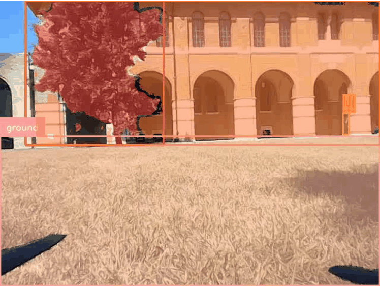
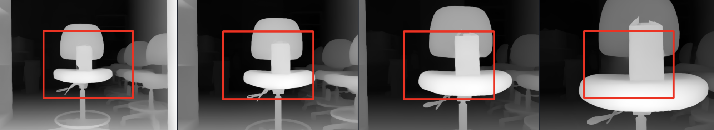

# Autodrone with Perception and Obstacle Avoidance

## Background
We aim to use AutoDrone to help humans in repetitive tasks. Current SOTA methods use various sensors (video, LiDAR, thermal) and process data locally to generate commands. Our approach integrates a webcam, Raspberry Pi, and 5G modem to enable the drone’s perception. Our system allows for the drone to identify obstacles in its path by transmitting images over 5G to an external server that infers depth of current frame. Our solution’s performance includes improved flight stability, successful image transmission and command return based on depth perception. Future work will focus on perception precision and automating flight controls after obstacle detection.

## Methods
- **Focus 1:** Panotic Segmentation -[Panotic Segmentation](https://github.com/IDEA-Research/Grounded-Segment-Anything.git)

  

Segmentatiion with GroundedSAM

- **Focus 2:** 3D Reconstruction-[Gaussian Splatting](https://github.com/Rice-MECE-Capstone-Projects/Autodrone/blob/main/Reconstruction/3dgs_depth/README.md); [Reconstruct with Lidar](https://github.com/Rice-MECE-Capstone-Projects/Autodrone/main/Reconstruction)

For the reconstruction and ego-motion localization in 24 Fall semester, we used [COLMAP](https://colmap.github.io) to perform feature detection, matching and sparse reconstruction. Please follow the official document for more details.

  

3D Gaussian Splatting representation of Ryon Lab, visualized with <a href="https://github.com/buaacyw/GaussianEditor">GaussianEditor GUI</a>.

- **Focus 3:** Depth Perception-[Depth_Estimator](https://github.com/PeaceNeil/Depth_Estimator_594/blob/main/README.md);

  

Predicted Depth as the camera approaches the obstacles

## Report
Autodrone team final report from ELEC 594 Capstone Project in Spring 2024 at Rice University：     
[ELEC594 Autodrone_project_final_report](https://github.com/Rice-MECE-Capstone-Projects/Autodrone/blob/main/Report/ELEC594_Autodrone_project_final_report.pdf)

This project is licensed under the Electrical and Computer Engineering Department at Rice University

